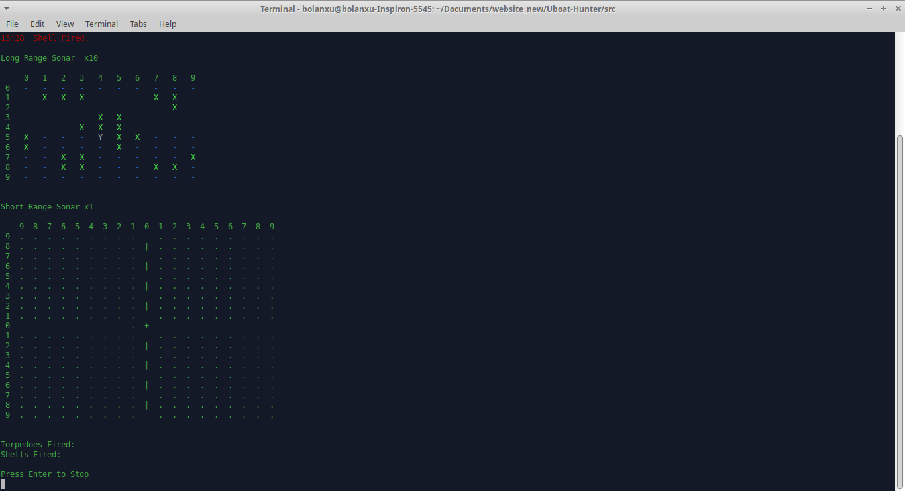

# Submarine Hunter

A command-line text based realtime strategy game based on the game Silent Hunter by Ubisoft.

The objective of the game is to defeat the other submarines or more specifically, German Uboats using torpedos and other weapons.
### Don't forget to change the ip in the client program to the ip of your server computer.

Start the server.py program on one computer and join with either the client_input.py or client_no_input.py. (Up to five players)
The client_input file has an interface where the live view of the map stops when you select a command or option while
the other file constantaly updates the live view even when you are selecting options.

I made this project the summer of 2023 when I was in 7th grade, so the code is not very clean and my OOP skills were
not very developed yet.
